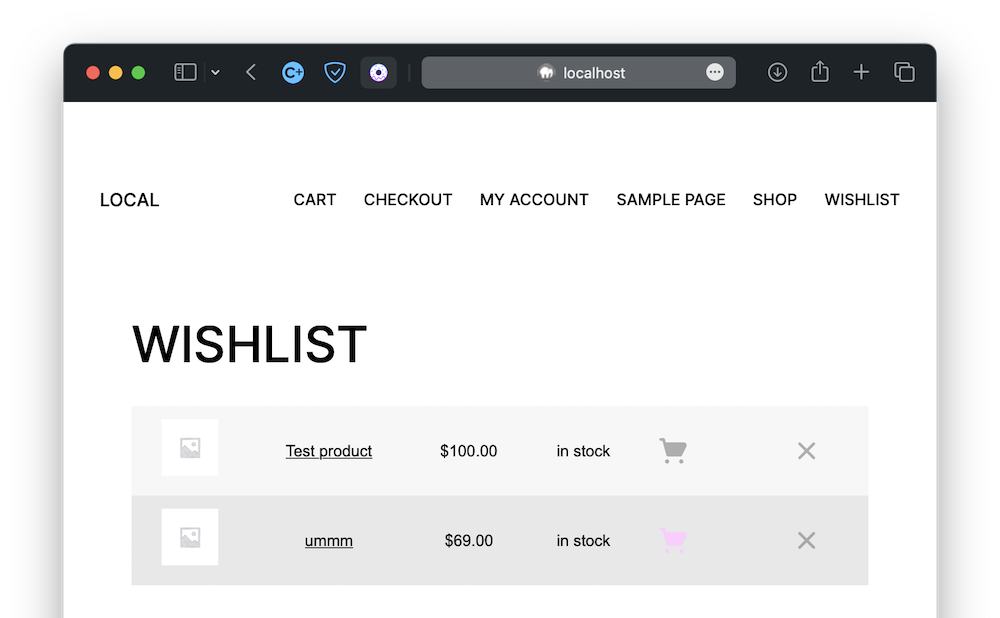
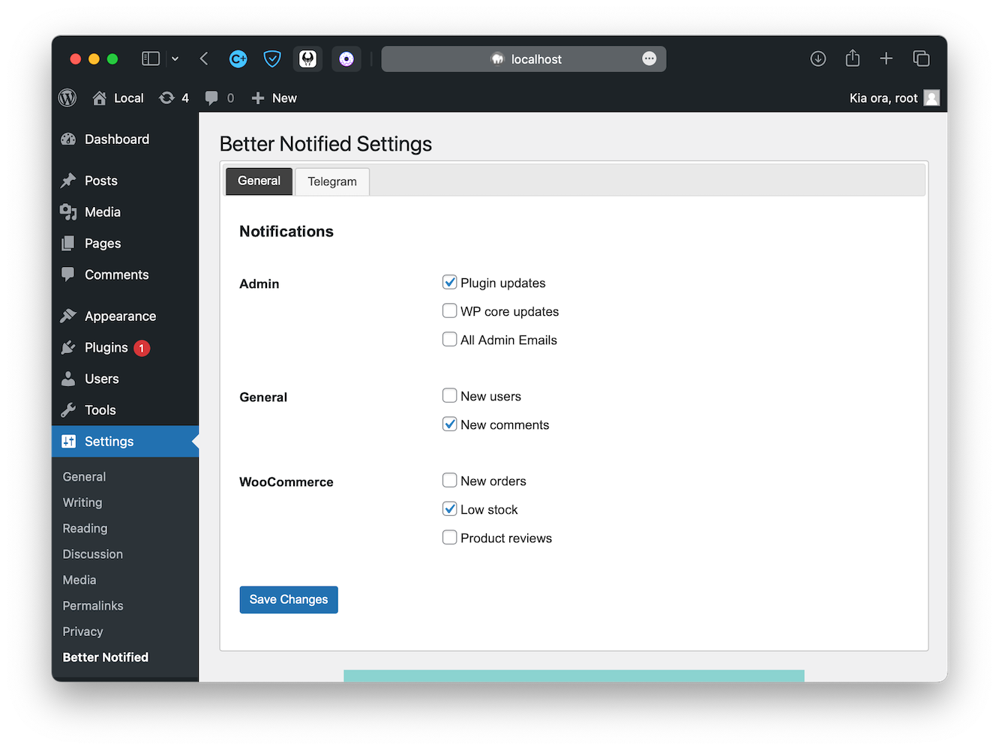
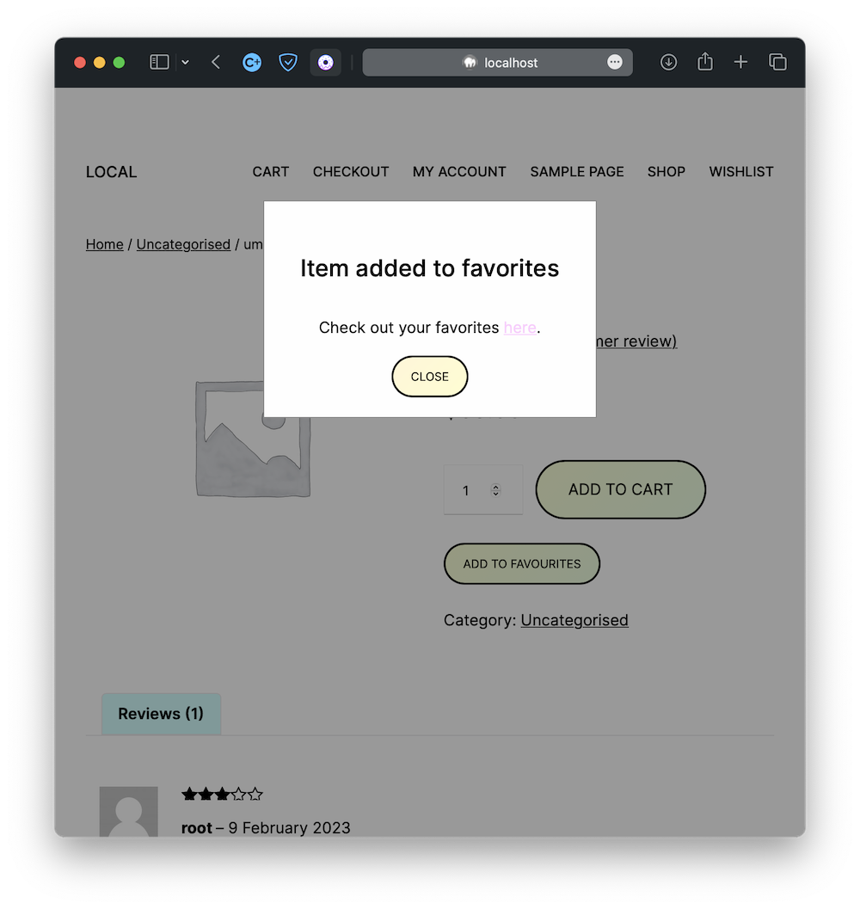
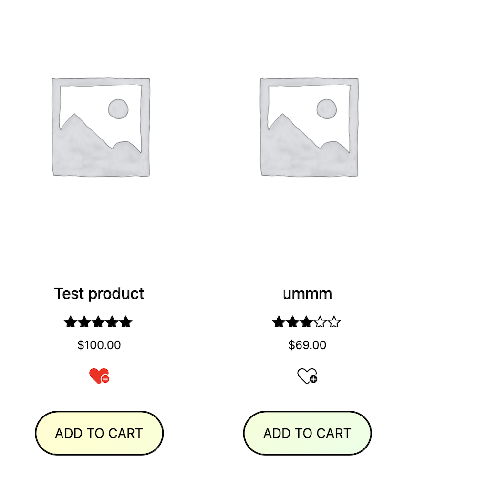

# AS User List

This is a wordpress plugin that allows users & customers to add any page, product or post to a favourite/ wishlist.

## Features

🔷 Chose from three different button types, Bookmark, Heart or default button

🔷 Allow products to display the add to list button.

🔷 easily change the button text or remove it all together in settings.

🔷 Add the button to any page via a shortcode [as_add_to_list]

🔷 Display the list on any page via the shortcode [as_display_list]

🔷 Plugin Update Checker is being used to push updates. [GitHub](https://github.com/YahnisElsts/plugin-update-checker)

    

## To Do List for V1 Release

🔷 Fix error code on display list shortcode that apears only with certain themes.

🔷 Add an add all to cart button to the list.

## Screenshots

    

Settings Page

    

Pop-up to notify user that its been added to the list

    

Shop Page showing the heart add to list button in both states

