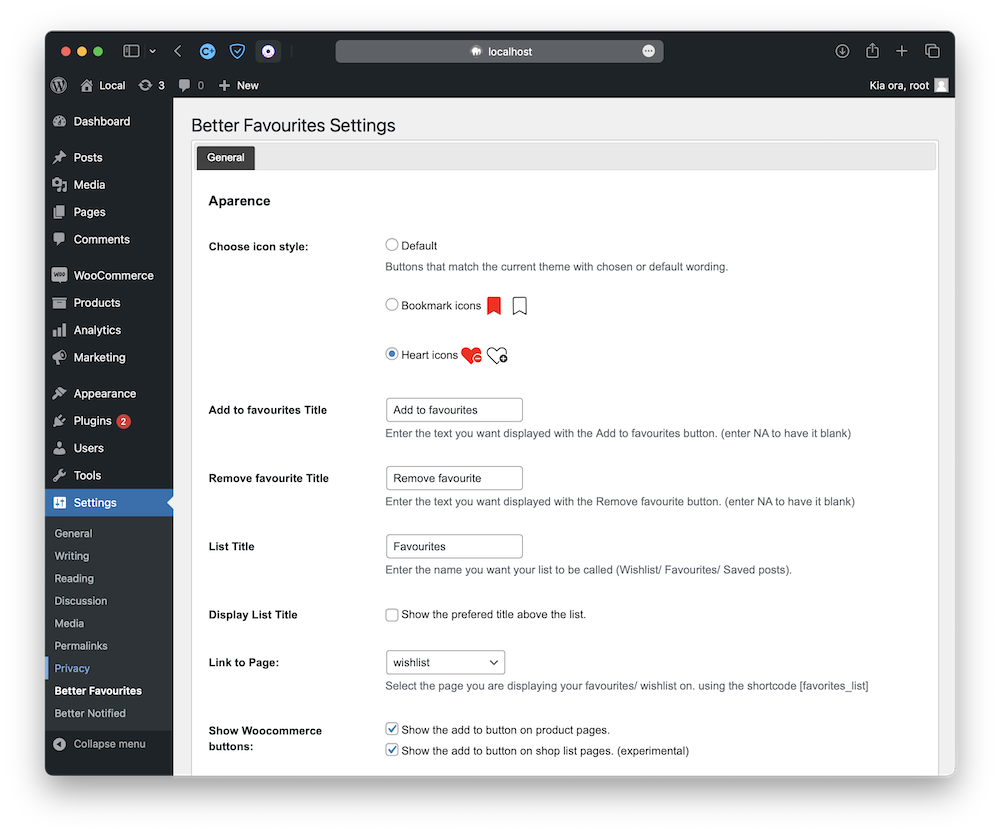

# AS User List

    

A flexible favourite & Wishlist wordpress plugin that allows users to add any page, product or post to their list.

## Features
BASIC FEATURES:

🔷 Add any page, product, or post to the list

🔷 Customize the list name (e.g., Wishlist, Favorites, Favorite Recipes, Watch List)

🔷 Choose from three button types: Bookmark, Heart, or default styled button

🔷 Display the "add to list" button on products

🔷 Rename or remove the "add to list" text

🔷 Integration with WooCommerce's "My Account" dashboard

🔷 Mobile device-friendly design

Shortcodes:
[as_display_list]

Use this shortcode to display the list on your desired page.

[as_add_to_list]

Use this shortcode to add the "add to list" button to any page.

Premium Features:

🔷 Stock Status: View the stock status of products in the list.

🔷 Direct Cart Addition: Add products to the cart directly from the list.

🔷 Comprehensive Overview: View a comprehensive overview of the pages and products in your customers' lists.

🔷 Widget: The top 5 pages or products in your customers' lists displayed on the dashbord with easy quick actions.

Upgrade to our premium version and unlock these fantastic features to take your user engagement to new heights.

    

## To Do List for V1 Release

🔷 Fix error code on display list shortcode that apears only with certain themes.

🔷 Add an add all to cart button to the list.

🔷 Add click to close on the background for the pop-up.

## Screenshots

    

Settings Page

    

Pop-up to notify user that its been added to the list

    

Shop Page showing the heart add to list button in both states

