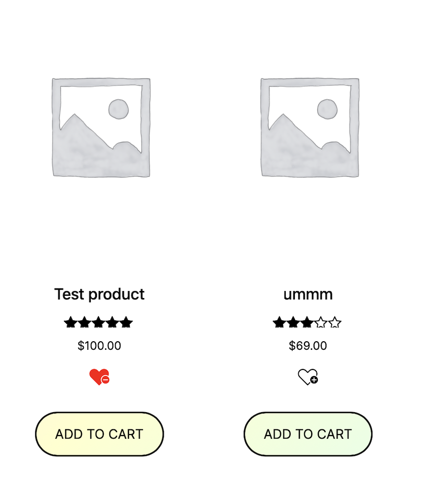

# AS User List

    

A flexible favourite & Wishlist wordpress plugin that allows users to add any page, product or post to their list.

Please note this is my second plugin for wordpress and I am new to PHP.

If you use and enjoy AS Notified consider Making a donation to support its development [Donate here](https://shop.azurestudio.co.nz)

## Features

🔷 Chose from three different button types, Bookmark, Heart or default button

🔷 Allow products to display the add to list button.

🔷 easily change the button text or remove it all together in settings.

🔷 Add the button to any page via a shortcode [as_add_to_list]

🔷 Display the list on any page via the shortcode [as_display_list]

🔷 Plugin Update Checker is being used to push updates. [GitHub](https://github.com/YahnisElsts/plugin-update-checker)

    

## To Do List for V1 Release

🔷 Fix error code on display list shortcode that apears only with certain themes.

🔷 Add an add all to cart button to the list.

🔷 Add click to close on the background for the pop-up.

## Screenshots

    

Settings Page

    

Pop-up to notify user that its been added to the list

    

Shop Page showing the heart add to list button in both states

write a description for my plugin

short description:
A flexible favourite & Wishlist plugin that allows users to add any page, product or post to their list.

Additional info:
🔷 Give your list a custom name, Wishlist, Favourites, Favourite recipies, Watch list ect
🔷 Chose from three different button types, Bookmark, Heart or default button

🔷 Allow products to display the add to list button.

🔷 easily change the button text or remove it all together in settings.

🔷 Add the button to any page via a shortcode [as_add_to_list]

🔷 Display the list on any page via the shortcode [as_display_list]
🔷 if woocommerce is installed the list is automaticaly added to the my account dashboard
🔷  designed for mobile devices

premium features:
🔷 allow customers to see the stock status in their list
🔷 allow customers to add products to their cart directly from their list
🔷 see what pages/ products are in your customders lists
🔷  a widget to easily see the top 5 pages/ products in your customers lists

Introducing our flexible and user-friendly Favorite & Wishlist plugin! With this powerful tool, your users can effortlessly add any page, product, or post to their list. You can customize the list name, be it Wishlist, Favorites, Favorite Recipes, Watch List, or anything you desire. The plugin offers three attractive button types: Bookmark, Heart, or a default styled button, ensuring a seamless user experience.

Notably, the plugin allows products to display the "add to list" button, enhancing convenience for your users. Modifying the button text or removing it altogether can be easily done through the settings, providing ultimate flexibility. By utilizing the shortcode [as_add_to_list], you can effortlessly add the button to any page.

To showcase the list, simply use the shortcode [as_display_list], enabling you to display it on any desired page. Furthermore, if you have WooCommerce installed, the list is automatically integrated into the "My Account" dashboard, streamlining the user journey. Our plugin is also thoughtfully designed for optimal performance on mobile devices, ensuring a seamless experience across platforms.

Unlock premium features with our paid version to further enhance your users' experience. Customers will be able to view the stock status of products in their lists, allowing for informed decision-making. Additionally, they can conveniently add products to their cart directly from their list, reducing friction in the purchasing process.
Gain valuable insights by accessing a comprehensive overview of the pages and products in your customers' lists.
There is also a widget included to easily see the top 5 pages or products in your customers' lists, with easy acess "view" & "edit" buttons, incass you want to put some of the top items on sale.

Introducing the flexible and user-friendly AS User List plugin!
With this powerful tool, your users can effortlessly add any page, product, or post to their list. You can customize the list name, be it Wishlist, Favorites, Favorite Recipes, Watch List, or anything you desire. The plugin offers three attractive button types: Bookmark, Heart, or a default styled button, ensuring a seamless user experience.

Notably, the plugin allows products to display the "add to list" button, enhancing convenience for your users. Modifying the button text or removing it altogether can be easily done through the settings, providing ultimate flexibility. By utilizing the shortcode [as_add_to_list], you can effortlessly add the button to any page.

To showcase the list, simply use the shortcode [as_display_list], enabling you to display it on any desired page. Furthermore, if you have WooCommerce installed, the list is automatically integrated into the "My Account" dashboard, streamlining the user journey. Our plugin is also thoughtfully designed for optimal performance on mobile devices, ensuring a seamless experience across platforms.

Unlock premium features with our paid version to further enhance your users' experience. Customers will be able to view the stock status of products in their lists, allowing for informed decision-making. Additionally, they can conveniently add products to their cart directly from their list, reducing friction in the purchasing process.
Gain valuable insights by accessing a comprehensive overview of the pages and products in your customers' lists.
There is also a widget included to easily see the top 5 pages or products in your customers' lists, with easy acess "view" & "edit" buttons, incass you want to put some of the top items on sale.

BASIC FEATURES:
🔷 Add any page, product, or post to the list
🔷 Customize the list name (e.g., Wishlist, Favorites, Favorite Recipes, Watch List)
🔷 Choose from three button types: Bookmark, Heart, or default styled button
🔷 Display the "add to list" button on products
🔷 Rename or remove the "add to list" text
🔷 Integration with WooCommerce's "My Account" dashboard
🔷 Mobile device-friendly design

Shortcodes:
[as_display_list]
Use this shortcode to display the list on your desired page.
[as_add_to_list]
Use this shortcode to add the "add to list" button to any page.

Premium Features:
🔷 Stock Status: View the stock status of products in the list.
🔷 Direct Cart Addition: Add products to the cart directly from the list.
🔷 Comprehensive Overview: View a comprehensive overview of the pages and products in your customers' lists.
🔷 Widget: The top 5 pages or products in your customers' lists displayed on the dashbord with easy quick actions.

Upgrade to our premium version and unlock these fantastic features to take your user engagement to new heights.

There are several ways to install AS User List:

1. FROM THE WORDPRESS ADMIN PANEL:
Go to “Plugins” > “Add New” and search for “AS User List.”
Click the “Install Now” button for the “AS User List” plugin.
After the installation is complete, click the “Activate” link (Plugins > Installed Plugins).
2. INSTALL MANUALLY USING THE FTP METHOD.
Download the plugin.
Upload the plugin folder into the /wp-content/plugins directory of your WordPress installation using your favorite FTP client.
Navigate to the “Plugins” > “Installed Plugins” section in your dashboard and activate the plugin.
3. INSTALL MANUALLY FROM THE WORDPRESS ADMIN PANEL
Download the plugin.
Go to “Plugins” > “Add New” and press the “Upload Plugin” button.
Browse the plugin archive and click “Install Now.”
After the installation is complete, click the “Activate” link (Plugins > Installed Plugins).
